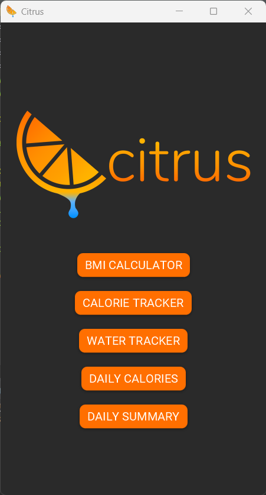
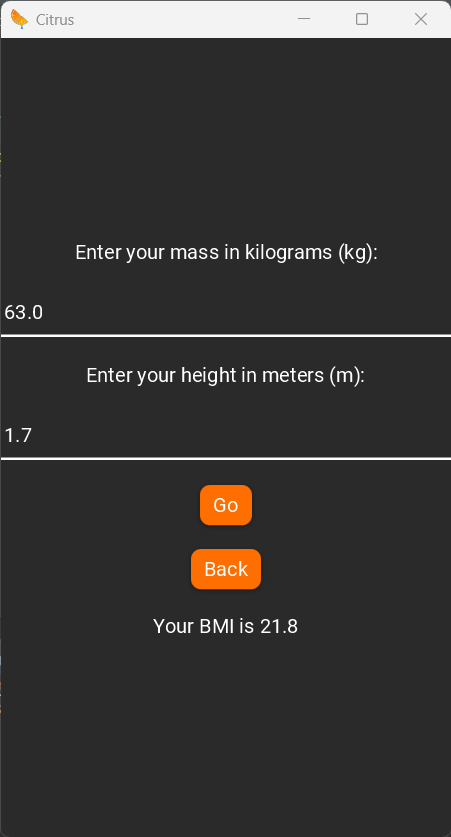
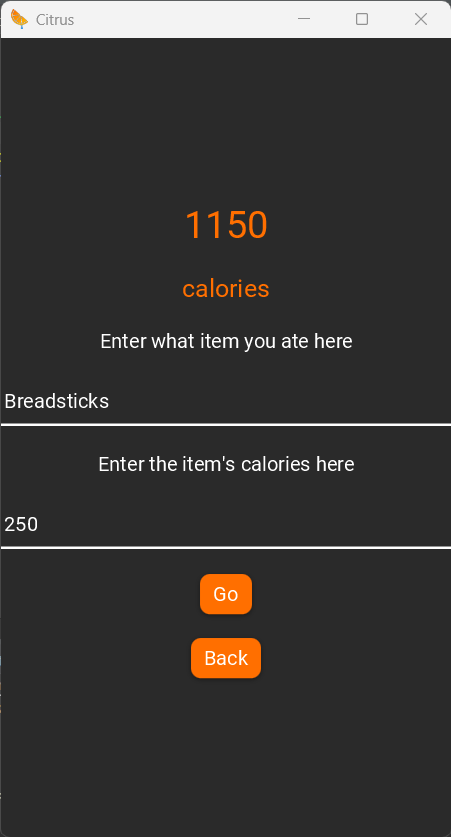
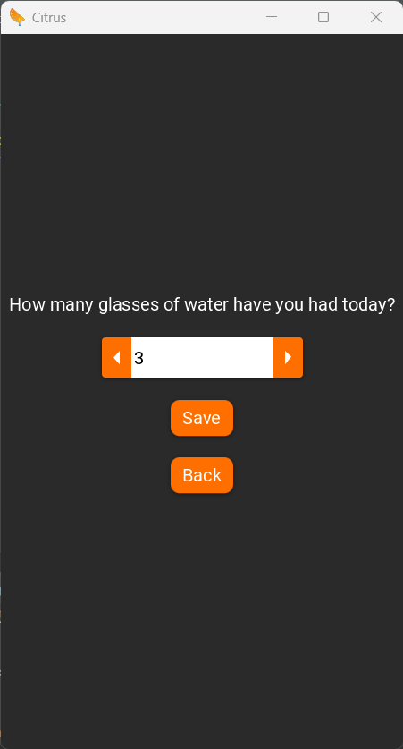
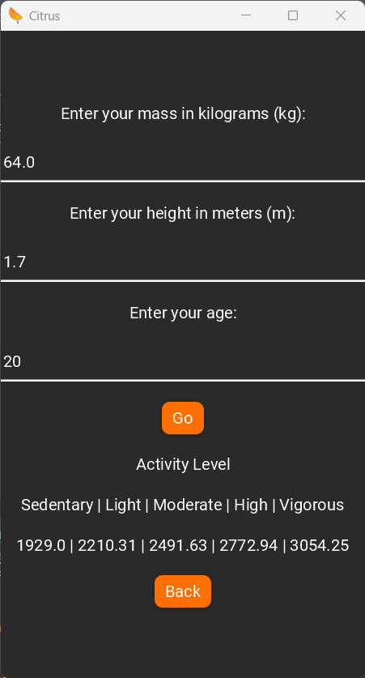
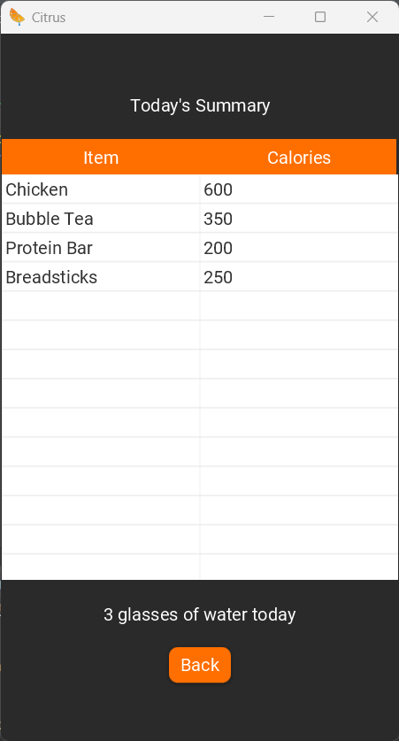

#  Citrus

 

A Calorie Tracker/Fitness App developed in Java using JavaFX for the GUI

The program has various functions such as:
* **BMI Calculator**
* **Calorie Tracker**
* **Water Tracker**
* **Recommended Daily Calorie Intake Calculator**
* **Daily Summary**

  
   
  

  
   
  

